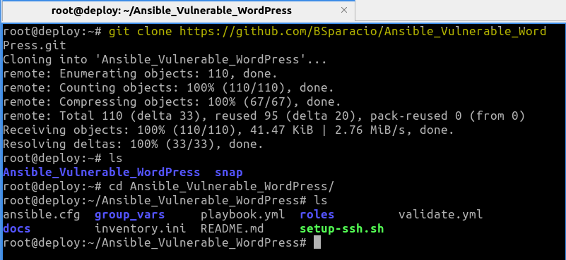
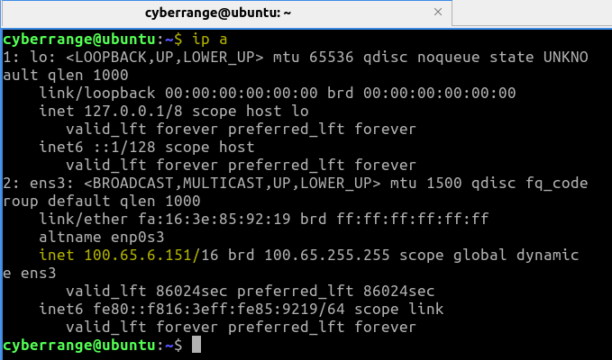
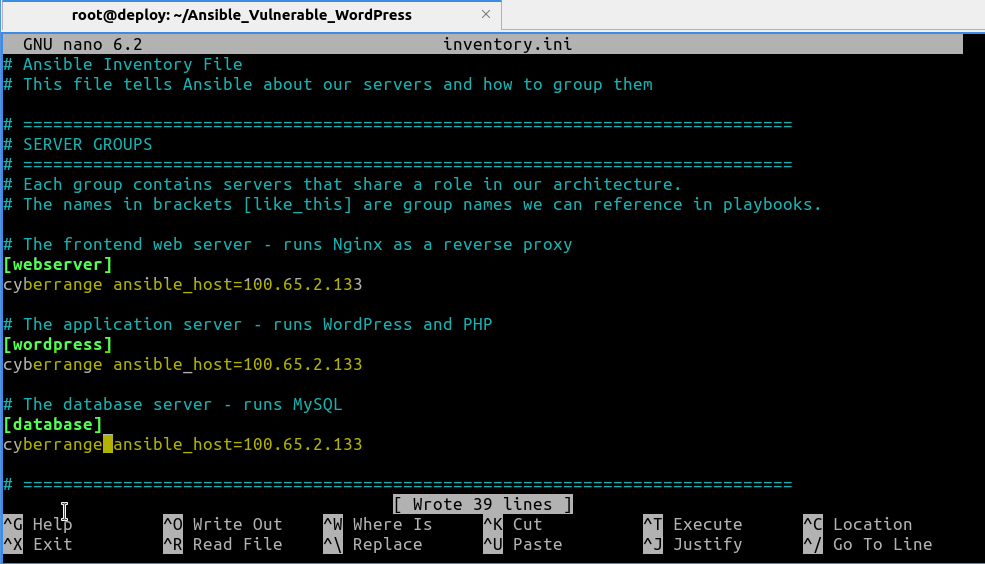
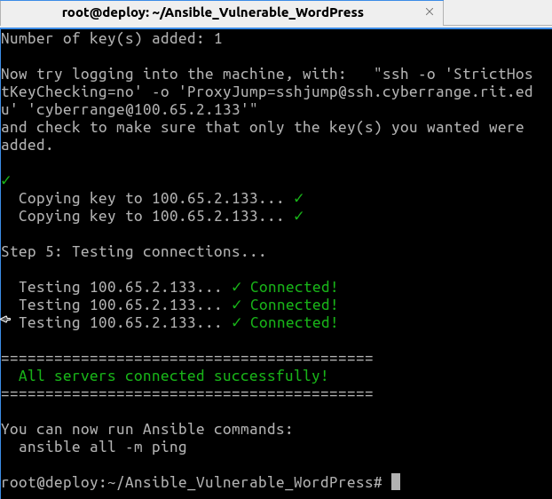
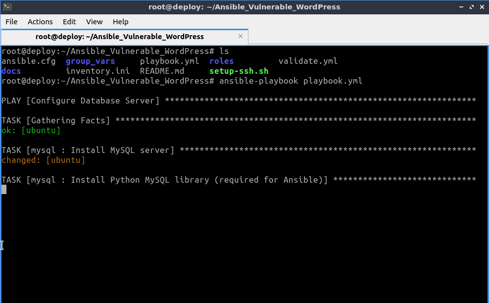
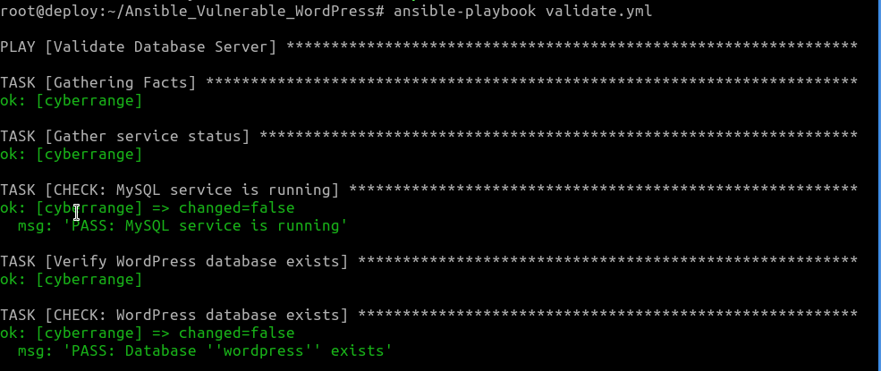
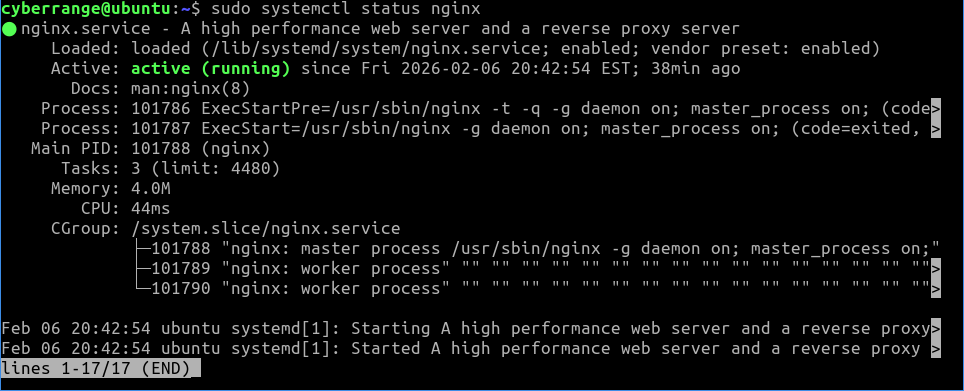
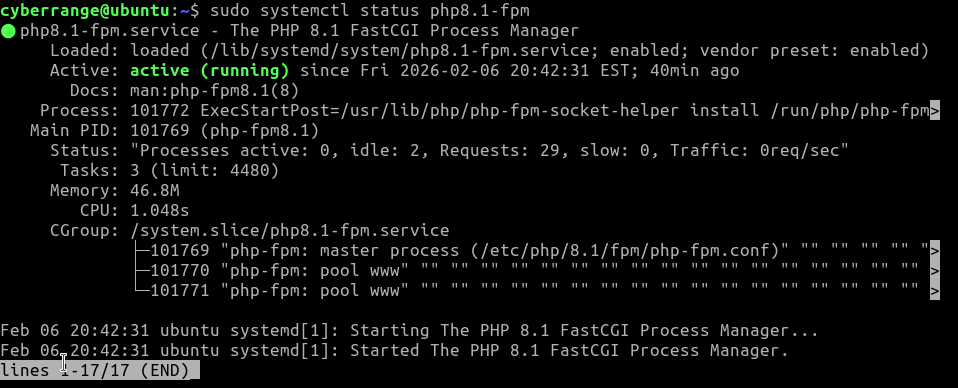
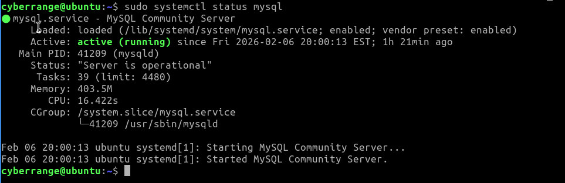
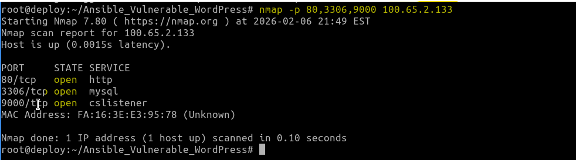

# Deployment Documentation

## Back to README
→ [Go to README.md](../README.md)

## Prerequisites

- Target OS: Ubuntu 22.04 LTS
- Ansible version: 2.16.3
- Required control machine packages: ansible, ansible-lint, sshpass, git, python3
- The architecture requires open communication between the tiers. Specifically, the Database Server must accept traffic on TCP port 3306 , and the WordPress Application Server must accept traffic on TCP port 9000
- The Ansible control node must have SSH access (root or sudo user) to all target machines defined in the ```database```, ```wordpress```, and ```webserver``` host groups
- Create an ```inventory.ini``` file mapping your IP addresses to the groups: ```database```, ```wordpress```, and ```webserver```

## Installation & Configuration

### Step 1: Clone the GitHub Repository

- Access the GitHub repository here: https://github.com/BSparacio/Ansible_Vulnerable_WordPress.git
- Clone the repository on a suitable host such as Ubuntu 22.04 LTS

In a terminal, run:

```bash
git clone https://github.com/BSparacio/Ansible_Vulnerable_WordPress.git
```

Expected output:

- A new directory named Ansible_Vulnerable_Wordpress
- All necessary files inside the new directory

   

### Step 2: Update Inventory With Correct Server IPs

Open `inventory.ini` and update the IP addresses to match the target server:

Expected file layout:

```ini
[webserver]
<HOSTNAME> ansible_host=<YOUR_TARGET_IP>

[wordpress]
<HOSTNAME> ansible_host=<YOUR_TARGET_IP>

[database]
<HOSTNAME> ansible_host=<YOUR_TARGET_IP>
```






### Step 3: Set Up SSH Keys

This will:
- Generate an SSH key (if you don't have one)
- Copy your key to the target server
- Test the connections

In a terminal, run:

```bash
./setup-ssh.sh
```

Expected output:

- You should see <span style="color: lime;">"All servers connected successfully!"</span> output to the terminal upon success



### Step 4: Run the playbook.yml File

In a terminal, run:

```bash
ansible-playbook playbook.yml 
```

Expected output:
 
- You should see each play begin with a header that identifies the current role being set up



## Verification Steps

### Service Status Verification

After the playbook completes, you may verify that the critical services are active on their respective nodes by following these steps.

### 1. Access the Vulnerable Service

To verify if everything has worked as intended, open a browser and visit:

```
http://YOUR_WEBSERVER_IP
```

Expected output:
- You should see the WordPress webpage with the "MAELSTROM_DATA_LINK_V.4.0" interface and a text input box to enter SQL SELECT queries!


### 2. Run the validate.yml File

This will:

- Check that each tier of the stack is configured correctly
- Each check prints a PASS or FAIL message so you can see what is working

In a terminal, run:

```bash
ansible-playbook validate.yml 
```



### 3. Complete Manual Checks

This will:

- Verify if a given service is installed and running

In a terminal with elevated privilege, run:

```bash
systemctl status nginx
```



or

```bash
systemctl status php8.3-fpm
```



or

```bash
systemctl status mysql
```



Expected output:

- nginx is installed and active
- php8.3-fpm is installed and listening on port 9000
- mysql is installed and active

### Vulnerability & Application Verification

1. Test the Vulnerability: Open the browser's developer tools (Network Tab) and type a search term. Verify that a request is sent to /index.php?rest_route=/ctf/v1/search.

2. Network Confirmation: An Nmap scan of the architecture should reveal HTTP (80) on the web server, Custom TCP (9000) on the app server, and MySQL (3306) on the database server.



## Back to README
→ [Go to README.md](../README.md)
